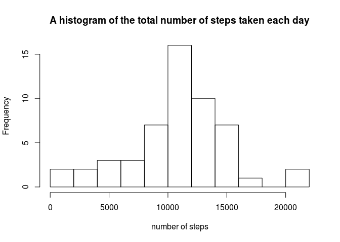
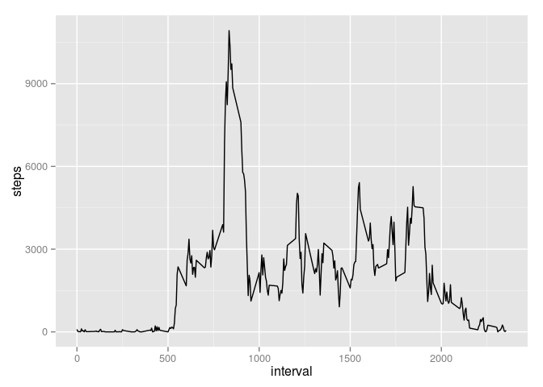
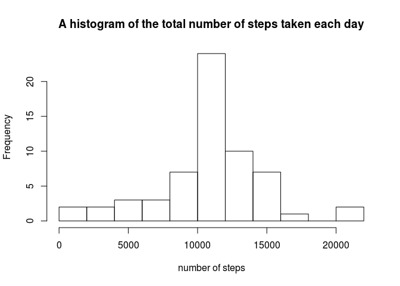
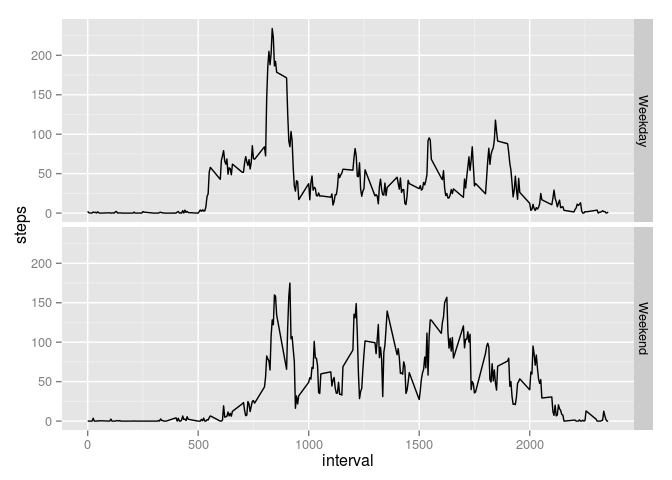

# Reproducible Research: Peer Assessment 1

## Loading and preprocessing the data

```r
setwd("~/RepData_PeerAssessment1")
unzip(zipfile = "activity.zip")
data <- read.csv(file = "activity.csv")

library(lubridate)
data$date <- ymd(data$date)
```
## What is mean total number of steps taken per day?


```r
library(dplyr)
```

```
## 
## Attaching package: 'dplyr'
## 
## The following objects are masked from 'package:lubridate':
## 
##     intersect, setdiff, union
## 
## The following object is masked from 'package:stats':
## 
##     filter
## 
## The following objects are masked from 'package:base':
## 
##     intersect, setdiff, setequal, union
```

```r
daily<- data %>% group_by(date) %>% summarise(dailysteps = sum(steps))
dailysteps <-daily$dailysteps
```

A histogram of the total number of steps taken each day

```r
hist(x = daily$dailysteps,breaks = 15,xlab = "number of steps",main="A histogram of the total number of steps taken each day")
```

 

Calculate and report the mean and median of the total number of steps taken per day

```r
mean(dailysteps,na.rm=T)
```

```
## [1] 10766.19
```

```r
median(dailysteps,na.rm=T)
```

```
## [1] 10765
```
## What is the average daily activity pattern?


```r
library(ggplot2)
daily_activity <- data %>% group_by(interval) %>% summarise(steps=sum(steps,na.rm=T))
qplot(x = interval,y = steps,data = daily_activity,geom = "line")
```

 

Which 5-minute interval, on average across all the days in the dataset, contains the maximum number of steps?

```r
daily_activity %>% filter(steps == max(steps))
```

```
## Source: local data frame [1 x 2]
## 
##   interval steps
## 1      835 10927
```
## Imputing missing values

1. Calculate and report the total number of missing values in the dataset (i.e. the total number of rows with `NA`s)


```r
sum(is.na(data[,1]))
```

```
## [1] 2304
```

2. Devise a strategy for filling in all of the missing values in the dataset. The strategy does not need to be sophisticated. For example, you could use the mean/median for that day, or the mean for that 5-minute interval, etc.


```r
mean <- mean(data$steps,na.rm=T)
```

3. Create a new dataset that is equal to the original dataset but with the missing data filled in.


```r
newData <- data %>% mutate(mean= replace(steps, is.na(steps), mean))
```

4. Make a histogram of the total number of steps taken each day and Calculate and report the **mean** and **median** total number of steps taken per day. Do these values differ from the estimates from the first part of the assignment? What is the impact of imputing missing data on the estimates of the total daily number of steps?


```r
newdaily<- newData %>% group_by(date) %>% summarise(dailysteps = sum(mean))
newdailysteps <- newdaily$dailysteps
hist(x = newdailysteps,breaks = 15,xlab="number of steps",main="A histogram of the total number of steps taken each day")
```

 

```r
mean(newdailysteps)
```

```
## [1] 10766.19
```

```r
median(newdailysteps)
```

```
## [1] 10766.19
```

## Are there differences in activity patterns between weekdays and weekends?

For this part the `weekdays()` function may be of some help here. Use
the dataset with the filled-in missing values for this part.

1. Create a new factor variable in the dataset with two levels -- "weekday" and "weekend" indicating whether a given date is a weekday or weekend day.

1. Make a panel plot containing a time series plot (i.e. `type = "l"`) of the 5-minute interval (x-axis) and the average number of steps taken, averaged across all weekday days or weekend days (y-axis). The plot should look something like the following, which was created using **simulated data**:


```r
plotdata <- data %>% 
    mutate(weekday= weekdays(data$date,abbreviate = T)) %>% 
    mutate(isWeekend = ifelse(weekday %in% c("Sat", "Sun"), "Weekend", "Weekday")) %>%
    group_by(isWeekend,interval) %>%
    summarise(steps=mean(steps,na.rm=T))

library(ggplot2)
plot <- ggplot(data = plotdata)
plot+geom_line(aes(x=interval,y=steps))+ facet_grid(isWeekend~.)
```

 
